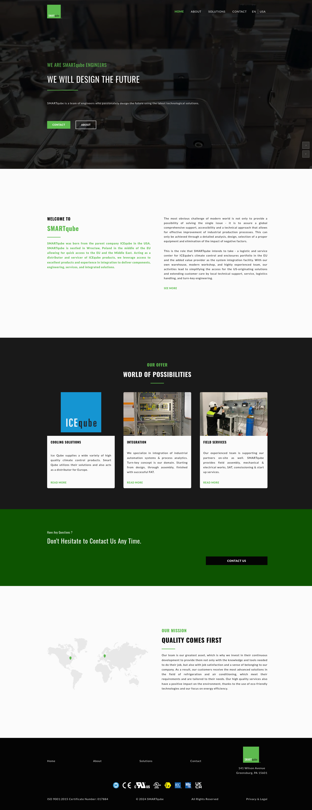

#  🌍 SMARTqube - Comprehensive Industrial Solutions

SMARTqube is a cutting-edge engineering company with a mission to design and deliver the future of industrial solutions. Originating as a strategic extension of ICEqube in the USA, SMARTqube is based in Wrocław, Poland, serving as a crucial hub for the European and Middle Eastern markets. The company focuses on providing high-quality climate control products, industrial automation, and integrated solutions that enhance productivity and efficiency in various industrial sectors.

## 🙋🏼‍♀️ Live demo:
[](https://www.smartqube.com/home)

**[Click here to  the live site](https://www.smartqube.com/home)**

## ⭐ Key Features:
The SMARTqube website is organized into several subpages that are described below:

#### 🏠 Home Page:
The home page introduces SMARTqube with a sleek and professional interface, reflecting the company's commitment to excellence in engineering and industrial solutions. Users can easily navigate to key sections such as 'About', 'Solutions', and 'Contact' to learn more about the company's offerings.

#### 🏢 About Page:
The About page of SMARTqube introduces the company's origins and its strategic partnership with ICEqube, blending American reliability with European innovation. It highlights the expertise and passion of the SMARTqube team, whose diverse international experiences drive the company's success in delivering high-quality industrial solutions. The page emphasizes that the company's greatest asset is its people, dedicated to providing exceptional service and innovation.

#### 💼 Solutions Overview:
The "Solutions" section of the SMARTqube website expands into several detailed subpages, each focusing on specific areas of expertise:

* **Integration:** This subpage details SMARTqube's expertise in engineering, procurement, testing, packaging, shipping, and commissioning at final installation sites. They specialize in engineering design, mechanical and electrical systems, and control systems, ensuring compliance with local and international regulations across various industries.

* **Climate Control:** This section provides advanced cooling solutions from IceQube, including systems for hazardous locations. These products are supported by detailed manuals and certifications, ensuring efficient operation and compliance with industry standards. Access to these resources helps users maintain and verify their systems effectively.

* **Enclosures:** This subpage refers to SMARTqube's partnership with IceQube, offering robust enclosures designed to protect critical equipment in harsh industrial settings.

* **Services:** A comprehensive overview of the various support services offered by SMARTqube, including maintenance, repair, and on-site support.

#### 📞 Contact Section: 
The Contact section of the SMARTqube website is designed to facilitate easy communication between potential clients and the company. It features a user-friendly form where visitors can submit their name, phone number, company details, job position, and a message to inquire about services or discuss potential projects. The form also ensures compliance with GDPR regulations, requiring users to confirm their age and consent to data processing before submission.

#### 📜 Legal and Privacy Section: 
The Legal and Privacy section of the SMARTqube website provides users with essential documents and guidelines related to data protection and the company's operational policies. This section includes downloadable PDFs covering topics such as GDPR compliance, sales guidelines, terms and conditions, warranty details, and the company's privacy policy. Additionally, there is a link to explore the Cookie Policy, offering insights into how cookies are managed and providing users with the option to adjust their preferences. This section ensures transparency and helps users understand their rights and the company's commitment to protecting personal information.

#### 🌍 Multilingual and Regional Support: 
The SMARTqube website is multilingual, available in English, German, and Polish. It is also tailored for different regions, including Europe, the USA, and the United Kingdom. The user's language and region preferences are stored in context and cookies, ensuring that these settings are remembered across sessions. Users must accept cookies to browse the site freely, and they have the option to change their preferences or withdraw consent at any time.


## 🐞 Tech Stack


## 🤓 Summary 

The SMARTqube project presented a unique challenge in managing collaboration with various stakeholders, including sales teams, clients, an SEO company, and legal professionals. This experience taught me the importance of effective communication and teamwork in delivering a successful project. Additionally, I gained valuable skills in deploying websites to external servers and connecting the site to a purchased domain, further enhancing my technical expertise.

**Github frontend:** [https://github.com/OllaWilk/smartqubeapp](https://github.com/OllaWilk/smartqubeapp)

## 🦋 Installation project

**Clone the project:**

```
git clone https://github.com/OllaWilk/smartqubeapp.git
```

**Go to the project directory:**

```
cd smartqubeapp
```

**Install dependencies:**

```
npm install
```

**Start the server:**

```
npm start
```


